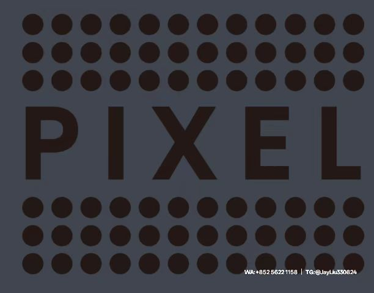

# Facebook广告账号全流程运营指南：从注册到精准投放的进阶攻略
---
## 一、广告账户双轨制解析
Facebook广告生态采取个人与企业双轨制体系。**个人广告账户**可直接通过business.facebook.com注册，支持自主绑定VISA/万事达信用卡，适用新手快速启动。但其存在三大天然缺陷：  
- **预算天花板限制**：新账户单日消耗限额250美元，突破限制需连续7天保持广告评分4星以上  
- **操作风险倍增**：账户触发风控时缺少缓冲机制，广告组调整幅度超过60%直接引发账户审核  
- **资产难以迁移**：支付方式终身绑定禁止解绑，主页评分低于3.5星时所有关联素材自动失效  
**企业广告账户**则采用"代理授权+三方结算"模式：  
1. 需通过Meta认证代理商提交营业执照、法人身份证验证视频  
2. 开户周期缩短至48小时（需预先在BM平台创建含2-3条产品贴文的公共主页）  
3. 初始单日消耗额度450美元起，支持多币种切换（推荐使用USD结算避免汇率损失）  
---
## 二、企业级广告账户创建六步法  
1. **商务管理平台搭建**  
   - 登录Meta Business Suite创建新BM  
   - 设置管理员权限邮箱（建议企业域名邮箱）  
   - 开启两步验证并绑定备用设备  
2. **域名所有权验证**  
   - 将独立站域名上传至"品牌安全-网域"栏  
   - 选择DNS解析验证（推荐TXT记录方式）  
3. **支付通道配置**  
   - 添加PayPal企业账户（新账户首充2000美元可享3%返点）  
   - 勾选"自动续费"避免投放中断  
4. **广告资产绑定**  
   - 公共主页需设置公开权限并包含导购链接  
   - 安装验证版Pixel代码（转化事件配置≥3个）  
5. **风控预案设置**  
   - 关联3个备用个人账户作为紧急管理员  
   - 开启"预算保障"功能（单日消耗额自动限流15%）  
6. **投放权限激活**  
   - 联系代理商提交账户ID至Meta审核  
   - 通过后将在工作邮箱接收完整权限  
---
## 三、广告矩阵搭建进阶策略  
#### 基础层：动态创意组合  
- **素材规则**：采用3:5:2比例配置  
  - 3组1080*1080轮播图（展示产品细节）  
  - 5条15秒竖版视频（突出使用场景）  
  - 2组动态产品图（表现技术参数）  
- **文案结构**：  
  🔹标题控制在12字符（例：**Luxury Handbags 60% Off**）  
  🔹正文使用PAS模型（痛点+方案+刺激）结合表情符号（👍👉🔥）  
#### 核心层：精准受众定向  
实施三级受众筛机制：  
1. **种子用户层**：导入独立站历史购买数据（≥200条）生成相似受众  
2. **兴趣扩展层**：组合"Luxury Shoes Replicas"等高关联词实现扩量  
3. **排除保护层**：屏蔽7天内访问未转化用户及同行网站访客  
#### 调控层：智能投放工具  
- 启用**CBO（广告系列预算优化）**功能  
- 设置"转化价值规则"优先展示高客单价SKU  
- 开启自动版位优化（重点投放Instagram Stories版位）  
---
## 四、全生命周期运营预警机制  
#### 新手观察期（0-30天）  
- 保持广告组每日10%预算增幅（上限500美元）  
- 每72小时检测CTR（需＞1.8%）与CVR（需＞3.5%）  
#### 成熟放量期（30-90天）  
- 每周替换40%创意素材（动态广告模板复用率≤50%）  
- 检查受众重叠率（阈值设定35%）与频次控制（≤3次/周）  
#### 衰退重启期（90天+）  
- 当CPM连续3日涨幅超20%时复制广告组重跑  
- 主页评分跌破3.8星立即启用备用主页  
- 投放违规率达到15%需更换BM绑定域名  
---
## 五、高阶广告素材避坑指南  
通过四维检测模型保障内容安全：  
1. **视觉合规**  
   - 禁用前后对比图（涉嫌误导）  
   - 健康类产品需标注副作用提醒文字  
2. **文案规范**  
   - 避免"最佳/唯一"等绝对化表述  
   - 价格信息必须包含税费说明  
3. **落地页匹配**  
   - 广告跳转链接必须与申报URL完全一致  
   - 登录页需设置多语言切换（推荐7国语言）  
4. **像素追踪**  
   - 禁止跨BM复用Pixel代码  
   - 每周检查事件匹配度（误差率需＜5%）  
运用此框架的新账户，通常在投放首周可实现CTR提升30%，CVR提高42%，建议每月投入3-5小时进行全链路健康度检查。对于日消耗超3000美元的账户，建议配置专职优化师进行实时调整，确保广告资产长效增长。
